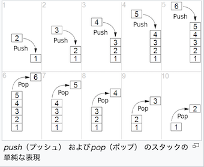

# 専門用語
- スタック：、コンピュータで用いられる基本的なデータ構造の1つで、データを後入れ先出し（LIFO: Last In First Out; FILO: First In Last Out）の構造で保持



- レジスタ：コンピュータのプロセッサなどが内蔵する記憶回路で、制御装置や演算装置や実行ユニットに直結した、操作に要する速度が最速の、比較的少量のもの

- スタートアップルーチン：
	- セット直後はRAM領域の値は不定であるので，初期値を代入している変数には初期値をROMから読み出してセットし，初期値を持たない変数には0を代入する． また， c++言語においては静的なクラスのコンストラクタをはじめに呼ぶ必要がある．
	- さらに，ヒープ領域を使用する場合にはその初期値をセットする必要がある． これらの処理をmain()実行に先立って行う

- static, extrenについて

```c
// 別のファイルからアクセス可能なグローバル変数を宣言
extern char greeting[];
extern float pi;
 
/*  error: static declaration of 'new_pi' follows non-static declaration
float new_pi;
*/
```

```c
#include <stdio.h>
#include "test.h"
 
static char pref[] = "Tokyo"; // staticグローバル変数(配列)
static float new_pi = 3.0f; // staticグローバル変数
 
char greeting[] = "Hello"; // グローバル変数
float pi = 3.14f; // グローバル変数
 
void exec() {
	printf("static: %f, %s\n", new_pi, pref);
}
```

```c
#include <stdio.h>
#include "test.h"
 
char* str() {
	static char greeting[64]; // 静的なメモリの確保
	sprintf(greeting, "%s %s!", "Hello", "World");
	return greeting;
}
 
int counter1() {
	static int cnt = 0; // staticローカル変数
	cnt++;
	return cnt;
}
 
int counter2(){
	int cnt = 0; // ローカル変数
	cnt++;
	return cnt;
}
 
int main(void) {
	//静的なメモリの値を取得
	printf("%s\n", str());
 
	int cnt1 = 0, cnt2 = 0;
	for(int i = 0; i < 3; i++) {
		cnt1 = counter1(); // staticローカル変数を取得
		cnt2 = counter2(); // ローカル変数を取得
		printf("%d回目, 初期値:%d\n", cnt1, cnt2);
	}
 
	//別のファイルのグローバル変数を出力表示
	printf("%s\n", greeting);
	printf("%f\n", pi);
 
	return 0;
}
```

- スコープ
	- ブロックスコープ：ブロック内で宣言された変数
	- ファイルスコープ：ブロック外で宣言された変数

- 修飾子
	- const：プログラム中で代入などの操作による変更ができない
		- const int \*pとint \* const pで意味が違う
		-  const int \*p：const int型へのポインタ　中身は書き換えられないが、ポインタは書き換えられる
		- int \* const p：qというコンスとポイントの型はint　つまりポインターが書き換えられない、中身の書き換えは可能

	- volatitle（組み込み用の宣言）：明示的な操作なしに変更されうる
		- コンパイラ時に適切な処理を行わせるための宣言
		- 最適化の対象(なくしちゃだめーよ)から外す

# メモリ確保

静的確保：下のように宣言すると、これらの配列に必要なメモリ領域はプログラム実行時に確保され、プログラム終了時までそのまま保持されます

```c
int data1[]={1, 2, 3, 4, 5, 6, 7, 8, 9, 10}; /* int型の配列 */
double data2[100];     /* double型の配列 */
```

動的確保：必要な時に、必要な分だけメモリ領域を確保する

```c
#include <stdio.h>
#include <stdlib.h>
 
int main(void) {
         int *ip;        /* 割り振られた領域のアドレスを格納するためのint型のポインタipを宣言 */
         int i, n;
 
         /* 確保する要素数を入力 */
         printf("Input a number : ");
         scanf("%d", &n);
 
         ip = (int *)malloc(n * sizeof(int));  /* メモリ領域の確保 */
 
         for (i=0; i<n; i++)
                 ip[i] = i;
 
         for (i=0;i < n; i++)
                 printf("%d ", ip[i]);
         printf("\n");
 
         free(ip);       /* 確保したメモリ領域の解放 */
         return 0;
}
```